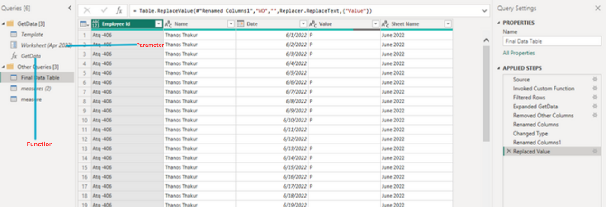
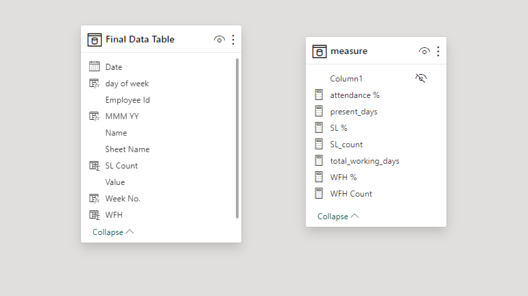
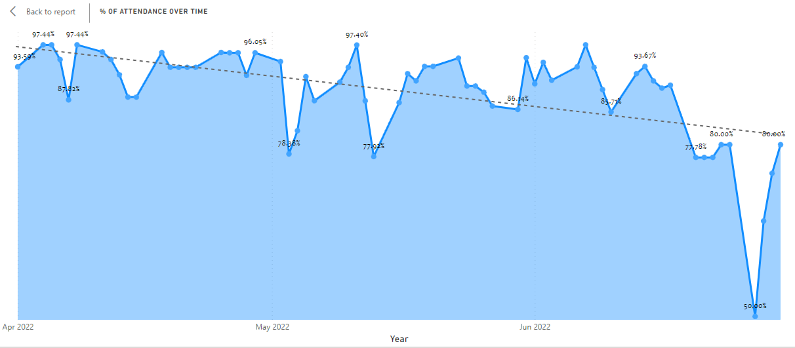
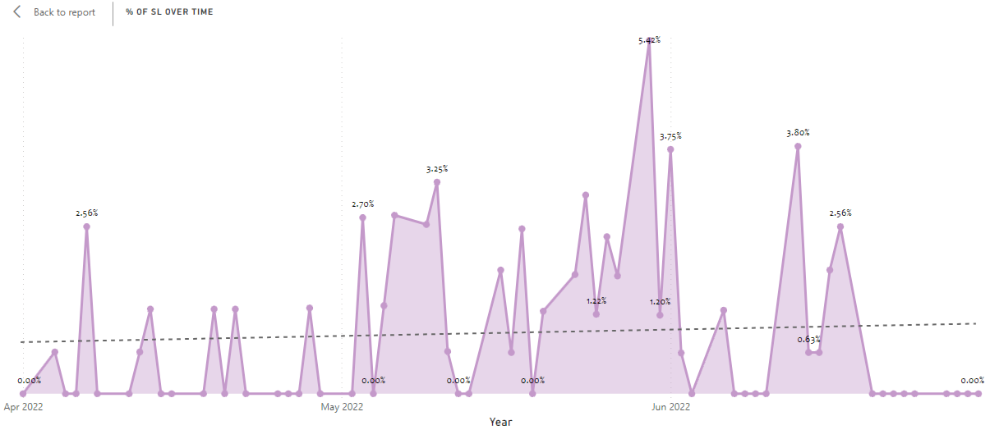
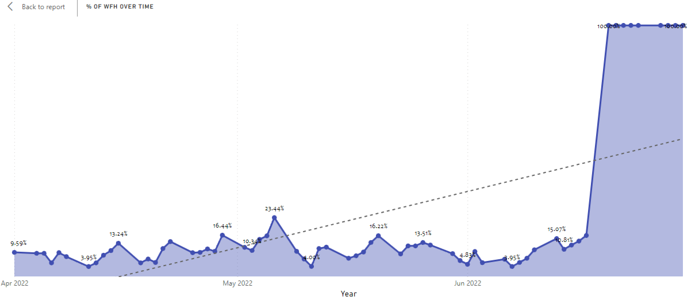
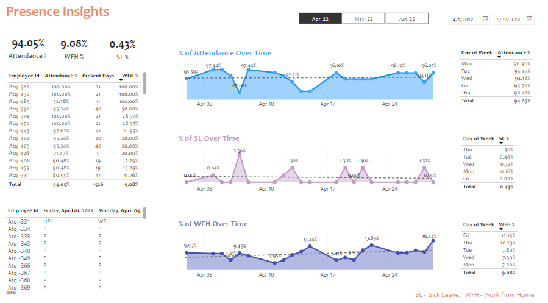

# HR Analytics PowerBI Project


## Introduction
Human resources (HR) is the division of a business that is charged with finding, recruiting, screening, and training job applicants. It also administers employee benefit programs.

HR plays a key role in helping companies deal with a fast-changing business environment and a greater demand for quality employees in the 21st century.

The purpose of the project is to analyze the daily attendance data and get some insights into employee behavior.

## Problem Statement

With this project, we aim to answer the below questions:

- How we can increase the attendance percentage?
- What is the impact of WFH on the attendance of the employee?
- What days do people take most of Sick Leave?
- Attendance trends for the last 3 months?

## Skills Demonstrated

The following PowerBI features were incorporated into this project: 

- Data Manipulation using parameters and functions.
- Data Analysis Expression (DAX) to create measures and calculated columns.
- Data visualization and Analysis.

## Data Sourcing

This project is done with the guidance of Codebasic, the data is provided by them on their website. The whole project is made with the assistance of Codebasic's [YouTube playlist](https://www.youtube.com/watch?v=ru1qeDO_qrc&list=PLeo1K3hjS3uuVQccZa7yFwK3ltoGQOWbM). The Data is saved in the Excel file with the name "Attendance Sheet 2022-2023_Masked".

## Data Transformation:
Data is in Excel file format which is uploaded in Power BI and transformed, the manipulation includes collating the same kind of data from different sheets into a single
with continuation based on the date, we used parameter and function features of PowerBI to perform the task.


Post the above step new measures and calculated columns were created:

#### Measures:
- Total Working Days: Total number of days the office was open for work.
```
total_working_days = 
var total_days = COUNT('Final Data Table'[Value])
var total_off = CALCULATE(COUNT('Final Data Table'[Value]), 'Final Data Table'[Value] in {"WO", "HO"})
RETURN total_days - total_off
```
- Present Days: Out of total working days how many days the employee was present or did WFH.
```
present_days = 
var present_day = CALCULATE(COUNT('Final Data Table'[Value]), 'Final Data Table'[Value] = "P")
return present_day + [WFH Count]
```
- Attendance Percent: It is the ratio of total present days to the total working days.
```
attendance % = DIVIDE([present_days], [total_working_days], 0)
```
- WFH Count and Percentage: Total number of days the employee did work from home, WFH % is the ratio of WFH count to the present days.
```
WFH Count = SUMX('Final Data Table', 'Final Data Table'[WFH])
WFH % = DIVIDE([WFH Count], [present_days], 0)
```
- SL Count and Percentage: Total number of days the employee took Sick Leave, SL % is the ratio of SL count to the present days.
```
SL_count = SUMX('Final Data Table','Final Data Table'[SL Count])
SL % = DIVIDE([SL_count], [total_working_days], 0)
```
#### Calculated Column:
- Day of the Week:
```
day of week = FORMAT('Final Data Table'[Date], "ddd")
```
- Month:
```
MMM YY = STARTOFMONTH('Final Data Table'[Date])
```
- Week Number:
```
Week No. = "W " & WEEKNUM('Final Data Table'[Date])
```
- Sick Leave Count:
```
SL Count = SWITCH(TRUE(),
  'Final Data Table'[Value]="SL",1,
  'Final Data Table'[Value]="HSL", 0.5,
    0)
```
- Work From Home (WFH) Count:
```
WFH = SWITCH(TRUE(),
'Final Data Table'[Value] = "WFH" , 1,
'Final Data Table'[Value] = "HWFH" , 0.5,
0)
```

## Data Modelling
For this project we used single excel file with multiple sheets, hence there would not be any connection between the model.


## Visualization
We used area chart to create visuals for the KPIs as given below:

`Percentage of Attendance Over time:`



`Percentage of SL Over time:`



`Percentage of WFH Over time:`



Also, tables and cards are used to create the full report and to show all the details of the project:



## Analysis and Conclusions
- Percentage of people preferring WFH is increasing, from 9.08% in April to 14.20% in month of July. 
- Attendance percent is low on Mondays or Fridays, people prefer taking leaves on these days in order to get long leaves (Including Weekoffs).
- Sick Leave % is maximum on Monday or Friday. However, the overall percentage is kept below 2%.
- Most People prefer WFH on Friday or Monday to get longer leaves.
- People with 100% WFH have almost 100% Attendance.

## Recommendation
- More people prefer WFH if employees were offered the WFH there is high percentage of chance that the attendance% will increase and SL% will decrease. 
- Fun activity should be done more often on friday so that employee would enjoy the work culture and avoid taking leaves and decrease the attendance%.

## Report
Please check out the link of the full report on [PowerBI](https://app.powerbi.com/view?r=eyJrIjoiYzI1ZDM5M2YtMWI2Ny00M2Y3LWJhZWQtNzA2ZGI3OGIzOGM2IiwidCI6ImRmODY3OWNkLWE4MGUtNDVkOC05OWFjLWM4M2VkN2ZmOTVhMCJ9) or on [NovyPro](https://www.novypro.com/project/hr-analytics-power-bi-project).

## References
 - [CodeBasics](https://www.youtube.com/watch?v=ru1qeDO_qrc&list=PLeo1K3hjS3uuVQccZa7yFwK3ltoGQOWbM)
 - [Power BI](https://learn.microsoft.com/en-us/power-bi/)

<nav >
<a href="https://www.linkedin.com/in/rathore793/">LinkedIn</a> |
<a href="https://github.com/rathore793">Github</a> |
<a href="https://www.novypro.com/profile_projects/rahulrathore">NovyPro</a> |
</nav>
